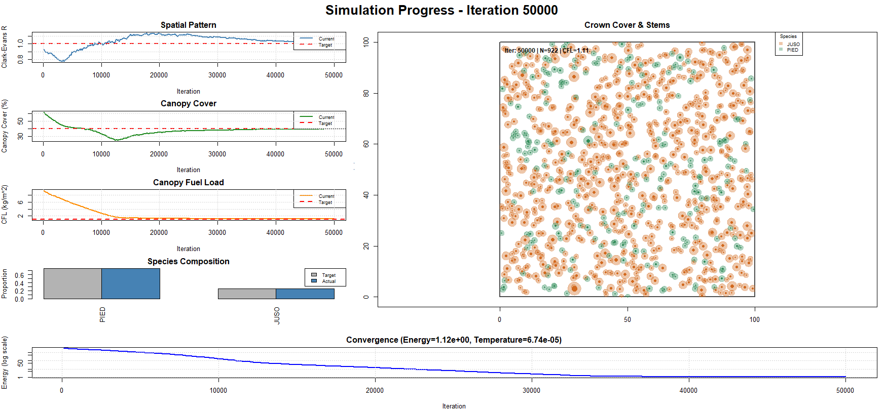

# EmpiricalPatternR 

<!-- badges: start -->


<!-- badges: end -->

Simulate realistic forest stand patterns using simulated annealing optimization to match empirical targets from field data.


## What does this package do?

**EmpiricalPatternR** generates synthetic forest stands that reproduce the structure and spatial patterns observed in real forests. You provide ecological targets — tree density, species mix, size distributions, canopy cover, fuel loads, and spatial arrangement — and the package uses **simulated annealing** to create a stand of individually located trees that matches all of those targets simultaneously.

The result is a tree list (species, DBH, height, crown dimensions, x/y location) that you can feed directly into fire-behavior models, use as a restoration reference, or analyze for pattern-process research.

### Who is this for?

| Use case | How EmpiricalPatternR helps |
|------------------------------------|------------------------------------|
| **Fire behavior modeling** | Generate stands with realistic canopy fuel structure for FlamMap, FARSITE, etc. |
| **Restoration planning** | Create quantitative stand-structure targets from published data |
| **Ecological research** | Explore how spatial patterns affect processes like facilitation or competition |
| **Teaching** | Demonstrate pattern-based ecology with fully reproducible examples |

### Key Features

-   **Pre-built configurations** for pinyon-juniper woodland (Huffman et al. 2009) and ponderosa pine
-   **Simulated annealing engine** that simultaneously optimizes spatial pattern, species composition, size distributions, canopy cover, and fuel loads
-   **Flexible allometry** with species-specific equations
-   **Fast C++ backend** with OpenMP parallelization
-   **Canopy fuel load (CFL)** and **canopy bulk density (CBD)** optimization for fire behavior
-   **Nurse tree effects** for modeling facilitation patterns (e.g., pinyon near juniper)
-   **Post-optimization mortality** to simulate disturbance events
-   **Comprehensive analysis** with automated reports, CSV exports, and multi-panel plots

## Installation

### Prerequisites

You need a working C++ toolchain because the package compiles C++ source at install time:

-   **Windows** — Install [Rtools](https://cran.r-project.org/bin/windows/Rtools/) (match the version to your R version)
-   **macOS** — Install Xcode Command Line Tools: `xcode-select --install`
-   **Linux** — Install `r-base-dev` or equivalent (`sudo apt install r-base-dev` on Ubuntu/Debian)

### Install from GitHub

``` r
# Install remotes if needed
install.packages("remotes")

# Install EmpiricalPatternR
remotes::install_github("bi0m3trics/EmpiricalPatternR")
```

To also build the vignettes during installation (takes a bit longer):

``` r
remotes::install_github("bi0m3trics/EmpiricalPatternR", build_vignettes = TRUE)
```

### Verify installation

``` r
library(EmpiricalPatternR)
packageVersion("EmpiricalPatternR")
# [1] '0.1.0'
```

## Quick Start

This minimal example simulates a pinyon-juniper woodland in under a minute.

### Step 1 — Load the package and pick a configuration

``` r
library(EmpiricalPatternR)

# Pre-built configuration based on Huffman et al. (2009) control data
config <- pj_huffman_2009(max_iterations = 10000)
```

`pj_huffman_2009()` returns a list with four components — `targets`, `weights`, `simulation`, and `allometric_params` — that together define the full simulation. You can override any default; for example, `pj_huffman_2009(density_ha = 800, canopy_cover = 0.35)`.

### Step 2 — Run the simulation

``` r
set.seed(123)
result <- simulate_stand(
  targets        = config$targets,
  weights        = config$weights,
  plot_size      = config$simulation$plot_size,
  max_iterations = config$simulation$max_iterations,
  verbose        = TRUE,
  plot_interval  = 2000,       # update plots every 2000 iterations
  use_nurse_effect = TRUE,     # place pinyon near juniper
  mortality_prop   = 0.15      # 15% post-simulation mortality
)
```

`simulate_stand()` returns a list containing:

| Element | Description |
|------------------------------------|------------------------------------|
| `result$trees` | `data.table` of every tree — x, y, Species, DBH, Height, CrownRadius, Status, … |
| `result$metrics` | Final stand metrics (density, canopy cover, CFL, Clark-Evans R, …) |
| `result$energy` | Final energy value (lower = closer to all targets) |
| `result$history` | `data.table` of energy and metrics recorded during optimization |
| `result$targets` | The targets you provided (useful for downstream functions) |

### Step 3 — Inspect results

``` r
# Quick console summary comparing simulated vs. target
print_simulation_summary(result)

# Multi-panel ggplot2 figure (spatial pattern, crowns, DBH histogram, convergence)
plot_simulation_results(result)

# Full analysis — console report + CSV files + optional PDF plots
analyze_simulation_results(
  result     = result,
  targets    = config$targets,
  prefix     = "my_woodland",
  save_plots = TRUE
)
```

`analyze_simulation_results()` writes four files to disk:

| File | Contents |
|------------------------------------|------------------------------------|
| `my_woodland_all_trees.csv` | All trees with attributes and live/dead status |
| `my_woodland_live_trees.csv` | Live trees only |
| `my_woodland_summary.csv` | Species-level summary statistics |
| `my_woodland_plots.pdf` | Multi-panel spatial and size-distribution plots |

## Create Custom Configurations

You are not limited to pinyon-juniper. `create_config()` takes named lists for each component so you can define any forest type:

``` r
config <- create_config(
  name = "Ponderosa Pine Stand",
  targets = list(
    density_ha    = 450,
    species_props = c(PIPO = 0.70, PSME = 0.20, ABCO = 0.10),
    species_names = c("PIPO", "PSME", "ABCO"),
    mean_dbh = 35.0, sd_dbh = 12.0,
    mean_height = 18.0, sd_height = 5.0,
    canopy_cover  = 0.45,
    cfl           = 0.85,
    clark_evans_r = 1.4
  ),
  weights = list(
    ce = 10, dbh_mean = 5, dbh_sd = 5,
    height_mean = 5, height_sd = 3,
    species = 80, canopy_cover = 70,
    cfl = 60, density = 90, nurse_effect = 0
  ),
  simulation = list(
    plot_size = 100, max_iterations = 50000,
    cooling_rate = 0.9999, verbose = TRUE,
    enable_plotting = TRUE, plot_interval = 5000
  ),
  allometric_params = get_ponderosa_allometric_params()
)

# Then run exactly as before
result <- simulate_stand(
  targets = config$targets, weights = config$weights,
  plot_size = config$simulation$plot_size,
  max_iterations = config$simulation$max_iterations
)
```

You can also generate an **editable R script** as a starting point:

``` r
generate_config_template(
  file        = "my_config.R",
  config_name = "my_custom_config",
  base_config = "pj"      # or "custom" for a blank template
)
# Edit my_config.R, then:
#   source("my_config.R")
#   config <- my_custom_config()
```

See the **Configuration Guide** vignette for a field-by-field explanation of every config entry:

``` r
vignette("configuration-guide", package = "EmpiricalPatternR")
```

## Understanding Weights

Weights control how hard the optimizer tries to match each target. They use a 0–100 scale:

| Range  | Priority | Effect                                          |
|--------|----------|-------------------------------------------------|
| 0      | Off      | Metric is ignored                               |
| 1–20   | Low      | Loosely matched; acts as a secondary constraint |
| 20–50  | Moderate | Balanced with other metrics                     |
| 50–80  | High     | Strong influence on final stand                 |
| 80–100 | Critical | Dominates optimization; matched first           |

A typical starting point for pinyon-juniper:

``` r
weights <- list(
  density      = 70,   # match tree count closely
  species      = 70,   # species proportions are important
  canopy_cover = 70,   # canopy cover matters for fuels
  cfl          = 60,   # fuel load is a key output
  ce           = 10,   # spatial pattern emerges naturally
  dbh_mean     = 2,    # size structure follows from density + allometry
  dbh_sd       = 2,
  height_mean  = 2,
  height_sd    = 2,
  nurse_effect = 20    # moderate facilitation pressure
)
```

## Allometric Equations

Built-in equations:

``` r
# Pinyon-juniper (default)
params_pj <- get_default_allometric_params()

# Ponderosa pine
params_pp <- get_ponderosa_allometric_params()

# Individual calculations
calc_height(dbh = 25, species = "PIED")
calc_crown_radius(dbh = 25, height = 8, species = "PIED")
calc_crown_base_height(dbh = 25, height = 8, species = "PIED")
calc_canopy_fuel_mass(dbh = 25, species = "PIED")
```

You can supply your own parameters as a nested list - see `?get_default_allometric_params` for the expected structure.

## Realtime Simulation Graphics

When `plot_interval` is set, the simulation updates a live multi-panel display showing the stand map, canopy cover, convergence history, and species proportions as the optimizer runs:



## Vignettes

After installation (with `build_vignettes = TRUE`), three vignettes walk through complete workflows:

``` r
# Field-by-field guide to every configuration entry
vignette("configuration-guide", package = "EmpiricalPatternR")

# Pinyon-juniper woodland simulation from start to finish
vignette("pinyon-juniper-woodland", package = "EmpiricalPatternR")

# Ponderosa pine forest with custom configuration
vignette("ponderosa-pine-forest", package = "EmpiricalPatternR")
```

## Simulation Workflow

```         
1. Define Configuration
   ├─ Pre-built:  pj_huffman_2009()
   ├─ Custom:     create_config(targets = ..., weights = ..., ...)
   └─ Template:   generate_config_template("my_config.R")

2. Run Simulation
   └─ simulate_stand()  →  simulated annealing optimization

3. (Optional) Apply Mortality
   └─ Built-in: mortality_prop argument in simulate_stand()
   └─ Manual:   simulate_mortality(trees, target_mortality_prop = 0.20)

4. Analyze & Export
   ├─ print_simulation_summary()
   ├─ plot_simulation_results()
   └─ analyze_simulation_results()  →  CSV + PDF outputs
```

## Citation

If you use this package in your research, please cite:

``` r
citation("EmpiricalPatternR")
```

### Literature

-   Pommerening, A., (2006). Evaluating structural indices by reversing forest structural analysis. *Forest Ecology and Management* 224, 266–277. <https://doi.org/10.1016/j.foreco.2005.12.039>

-   Pommerening, A. & Stoyan, D., (2008). Reconstructing spatial tree point patterns from nearest neighbour summary statistics measured in small subwindows. *Canadian Journal of Forest Research* 38, 1110–1122. <https://doi.org/10.1139/X07-222>

-   Huffman, D.W., Fulé, P.Z., Crouse, J.E., & Pearson, K.M. (2009). A comparison of fire hazard mitigation alternatives in pinyon-juniper woodlands of Arizona. *Forest Ecology & Management*, 257, 628–635. <https://doi.org/10.1016/j.foreco.2008.09.041>

-   Huffman, D. W., Stoddard, M. T., Springer, J. D., Crouse, J. E., Sánchez Meador, A. J., & Nepal, S. (2019). Stand Dynamics of Pinyon-Juniper Woodlands After Hazardous Fuels Reduction Treatments in Arizona. Rangeland Ecology and Management, 72(5), 757-767. <https://doi.org/10.1016/j.rama.2019.05.005>

-   Miller, E.L., Meeuwig, R.O., & Budy, J.D. (1981). Biomass of singleleaf pinyon and Utah juniper. Res. Pap. INT-273. Ogden, UT: U.S. Department of Agriculture, Forest Service, Intermountain Forest and Range Experiment Station. 18 p. <https://doi.org/10.2737/INT-RP-273>

-   Grier, C.C., Elliott, K.J., & McCullough, D.G. (1992). Biomass distribution and productivity of *Pinus edulis*--*Juniperus monosperma* woodlands of north-central Arizona. *Forest Ecology and Management*, 50, 331--350. <https://doi.org/10.1016/0378-1127(92)90346-b>

-   William A. Bechtold, Largest-Crown-Width Prediction Models for 53 Species in the Western United States, Western Journal of Applied Forestry, Volume 19, Issue 4, October 2004, Pages 245–251, <https://doi.org/10.1093/wjaf/19.4.245>

## Contributing

Contributions are welcome!

1.  Fork the repository
2.  Create a feature branch
3.  Add tests for new functionality
4.  Ensure `devtools::check()` passes with 0 errors and 0 warnings
5.  Submit a pull request

## License

GPL-3

## Contact

-   **Issues & feature requests:** [GitHub Issues](https://github.com/bi0m3trics/EmpiricalPatternR/issues)
-   **Documentation site:** <https://bi0m3trics.github.io/EmpiricalPatternR/>
-   **Package maintainer:** Andrew Sánchez Meador ([andrew.sanchezmeador\@nau.edu](mailto:andrew.sanchezmeador@nau.edu){.email})

------------------------------------------------------------------------

**Built with:** R, Rcpp, data.table, spatstat, ggplot2, gridExtra
